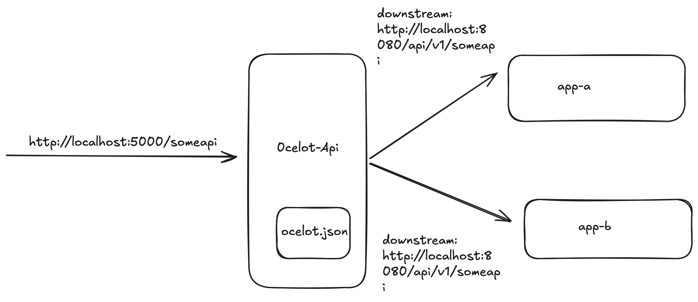

# ocelot-api-gateway

Ocelot is a lightweight, fast, and scalable API Gateway built on .NET Core. This repository demonstrates how to set up Ocelot using Docker and Docker Compose.

---

## Features ✨
- Simple configuration with `ocelot.json`.
- Ready-to-run Docker environment.
- Scalable with Docker Compose.

---

